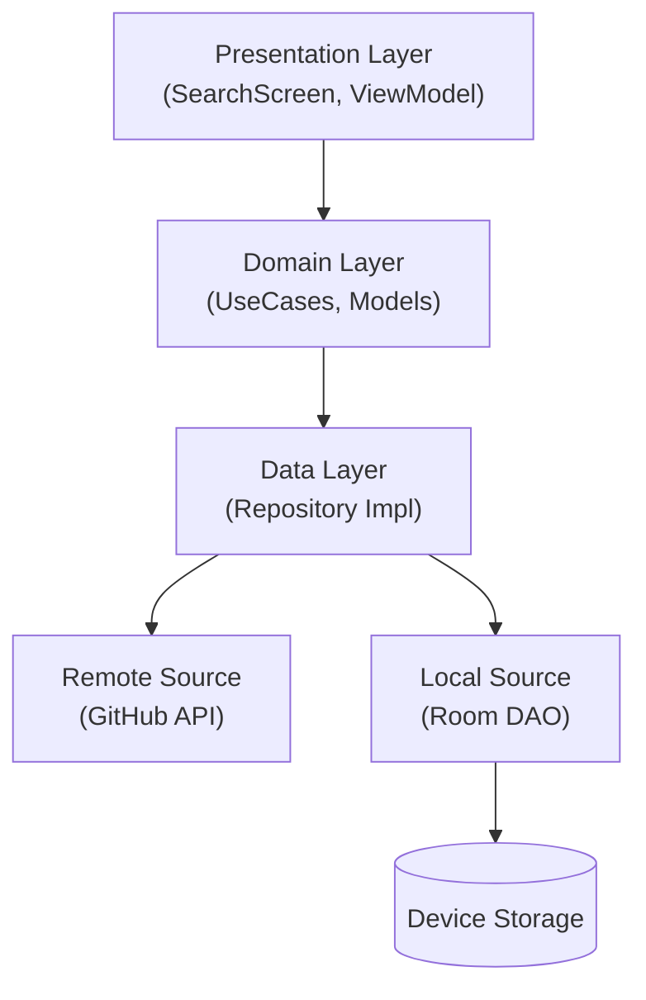

# RepoExplorer


**RepoExplorer** is a modern, high-fidelity Android application that allows users to search for GitHub repositories, view detailed statistics, and manage favorites offline. Built with a focus on **Clean Architecture**, **Material 3 Design**, and **Offline-First** principles.

---

## Screenshots

| Search & Pagination | Repository Details | Favorites (Offline) |
|:-------------------:|:------------------:|:-------------------:|
|  |  |  |
| *Infinite scrolling with Paging 3* | *2x2 Stats Grid & Readme Preview* | *Persisted via Room Database* |

> *Note: Screenshots are placeholders. Please add images to a `docs/` folder in your repository.*

---

## Key Features

* ** Infinite Search**: Leverages **Paging 3** to handle GitHub's search API efficiently, loading results in pages to minimize data usage and maximize performance.
* ** Offline Favorites**: Uses **Room Database** as a single source of truth for favorite repositories. Favorites are accessible even without an internet connection.
* ** Reactive UI**: Built entirely with **Jetpack Compose**, using `StateFlow` and `SharedFlow` for reactive, lifecycle-aware UI updates.
* ** High-Fidelity Design**: Implements a custom **Dark Mode** theme inspired by GitHub's "Dimmed" appearance, featuring custom cards, stat badges, and smooth transitions.
* ** Robust Error Handling**: Gracefully handles network errors, rate limiting (HTTP 429), and empty states with user-friendly feedback.

---

## Tech Stack

* **Language**: [Kotlin](https://kotlinlang.org/) (100%)
* **UI Toolkit**: [Jetpack Compose](https://developer.android.com/jetpack/compose) + Material 3
* **Architecture**: Clean Architecture (MVVM)
* **Dependency Injection**: [Hilt](https://dagger.dev/hilt/)
* **Network**: [Retrofit](https://square.github.io/retrofit/) + [OkHttp](https://square.github.io/okhttp/)
* **Local Storage**: [Room Database](https://developer.android.com/training/data-storage/room)
* **Pagination**: [Paging 3](https://developer.android.com/topic/libraries/architecture/paging/v3)
* **Async**: [Coroutines](https://github.com/Kotlin/kotlinx.coroutines) + [Flow](https://kotlin.github.io/kotlinx.coroutines/kotlinx-coroutines-core/kotlinx.coroutines.flow/)
* **Image Loading**: [Coil](https://coil-kt.github.io/coil/)

---

## Architecture

The app follows strict **Clean Architecture** principles to ensure separation of concerns and testability.



### Design Decisions & Trade-offs

1.  **Single Source of Truth for Details**:
    The `getRepo(id)` use case checks the local Room database first. If the user has favorited the repo, we serve the cached version immediately. This ensures the "Favorite" status is always accurate and persists across app restarts.

2.  **Paging 3 for Search**:
    Instead of a simple list, Paging 3 was chosen to handle the potentially infinite results from GitHub. This handles memory management and network efficiency out of the box.

3.  **State Hoisting**:
    UI components (like `RepoItem`) are stateless. All logic (toggling favorites, navigation) is hoisted to the `ViewModel` or Screen level, making components reusable and easier to test.

---

##Getting Started

1.  **Clone the repository**:
    ```bash
    git clone [https://github.com/EngFred/RepoExplorer.git](https://github.com/EngFred/RepoExplorer.git)
    ```
2.  **Open in Android Studio** (Hedgehog or newer recommended).
3.  **Sync Gradle** to download dependencies.
4.  **Run** on an Emulator or Physical Device.

*Note: The app uses the public GitHub API. No API Key is required for basic usage, though rate limits apply.*

---

##Contributing

Contributions are welcome! Please fork the repository and submit a pull request.

##License

This project is licensed under the MIT License - see the [LICENSE](LICENSE) file for details.
